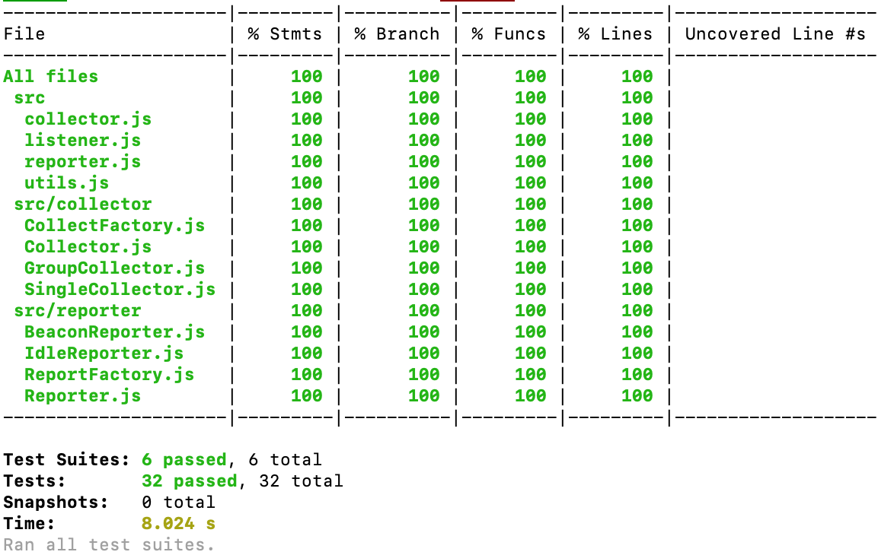

# perf-lib
performance library to measure ttfb, fcp, dom load and window load events as well as network timings for document, image, font, js and css

# links
See [changelog](./CHANGELOG.md) for current versions and feature plans.

# performance measurement
In order to calculate ttfb, fcp and more, Performance MDN interface can be used which is supported by modern browsers.
And because this interface and it's members are available in Web Workers, Web Workers can be used in order not to impact the pages where the performance measurement scripts are being used.

There are also lots of packages for performance measurement.
You can visit [this web page](https://github.com/csabapalfi/awesome-pagespeed-metrics) to see some of these packages.

The 2 packages that I like :
1. Google Chrome / web-vitals
2. Zizzamia / perfume.js

Because Google is the current authority for SEO, I believe we do not need to re-invent the wheels, because for performance measurement;
We are using the tools such as Page Speed Insights, Chrome User Experience Reports, Search Console's Speed Report so this script should also give report similar to these tools.
So in this project, I have used web-vitals npm package as the core performance measurement tool with some extra code that I have got from perfume.js.

# logging-reporting
Because I am using "Google Chrome / web-vitals" npm package and not implemented a new package using Performance MDN interface with Web Workers from scratch;
In order not to impact the client's web site performance, I have implemented two different reporting mechanism for performance measurement metrics;
1. IdleReporter - which uses window.requestIdleCallback to report metrics when the browser is idle that has polyfill from "requestidlecallback-polyfill" package.
2. BeaconReporter - which uses navigator.sendBeacon to report metrics that is being developed for analytics purposes which also uses polyfill from "navigator.sendbeacon" package.

# implementation guidelines
Actually I will create two different npm libraries for my different implementations but here I use Factory Pattern with Template Pattern in order to run them both by changing some parameters on the go to try both solutions (I will extract them to different packages later on);
- IdleReporter with SingleCollector (which pushes a metric and report it when the browser is idle by popping it out using window.requestIdleCallback)
- BeaconReporter with GroupCollector (which collects the metrics all together and reports them when document is hidden using navigator.sendBeacon)
For BeaconReporter some code blocks is used from "treosh / web-vitals-reporter" package.
I have not used Typescript here, which can be used of course, but I believe it is not needed for this small script. (development speed<->complexity)

# usage
You don't need to call anything to start measuring performance when using this library
You just need to build the project using the command:
> npm run build

Then first you need to take the polyfill.js file from lib folder and include it into your <head> tag (which is IMPORTANT)
> <head></head>

Then you just need to take the bundled main.js file from lib folder and include it to your web page before closing the </body> tag and before all your script tags:
> 

GZipped version can also be created using the command (which is around 2.6KB (which has two different implementations inside that I have described above):
> npm run release

# known issues
1. Current implementation is being built to be used directly inside a web site by adding the script into the web page.
So there is no need to call anything from client web page. So type and url variables are being set manually.

2. The standart version of "Google Chrome / web-vitals" package does not work accurately so I have used the polyfilled version.
Because of this reason we need to add another script (polyfill.js) into the <head> tag
Please see the [github page](https://github.com/GoogleChrome/web-vitals) for more info:
However, there are a few good reasons to consider using the "base+polyfill" version, for example:
- FID can be measured in all browsers.
- CLS, FCP, FID, and LCP will be more accurate in some cases (since the polyfill detects the page's initial visibilityState earlier).

# development packages
eslint, prettier is used for clean-code.
husky is used to push only the clean-code into git.
babel and webpack is being used to transpiling and building.
jsdoc and better-docs is being used to generate documentation.

# commands
- "build": builds and transpiles the code into lib/main.js
- "build:compress": creates a gzipped version
- "release": creates a build and a gzipped version of this built
- "lint": run eslint
- "lint:fix": run eslint with autofix
- "format": format code using prettier
- "docs": generate documentation
- "test": run tests

# testing
You can run the tests by running the command:
> npm run test

Jest is being used for testing the whole library.
There are 3 skipped tests right now which are skipped because the API gateway is not ready (xmlhttprequest and navigator.sendBeacon method calls are commented out).
When these methods are being activated, the code coverage will be (which is already tested):

# todo
measured values will be validated against other Google Tools which uses web-vitals, fine adjustments may be needed
missing requirements to be added (assets loading performance by using, performance.getEntriesByType)
api calls will be enabled after API gateway is ready (maybe an AnalyticsReporter class will be added)
two different npm packages can be created from this package later on
